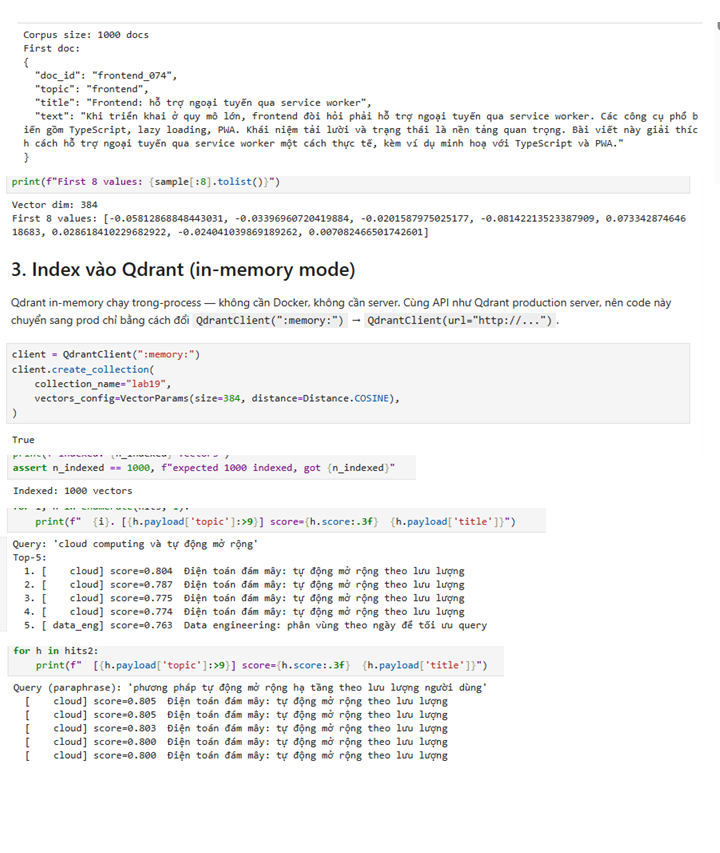
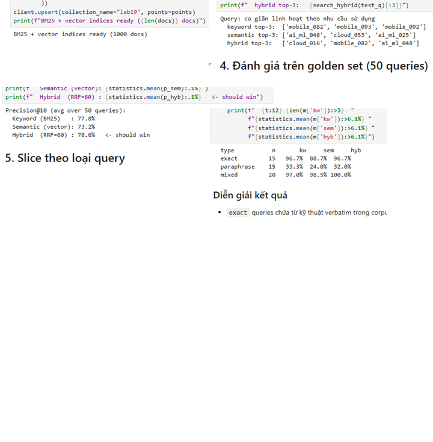
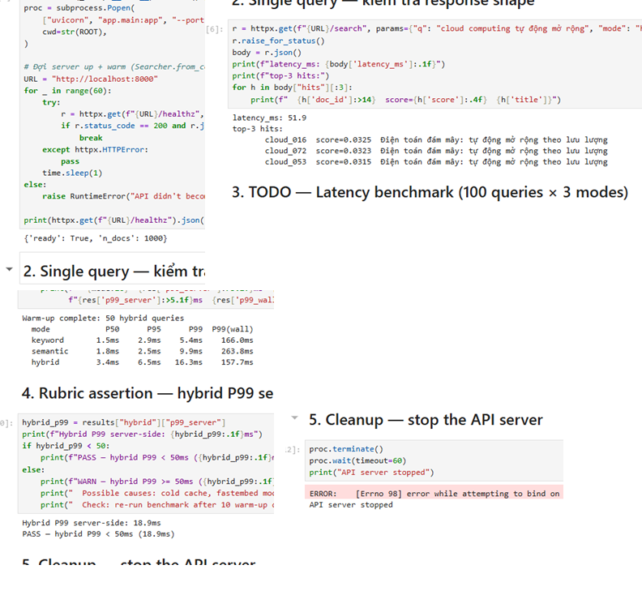
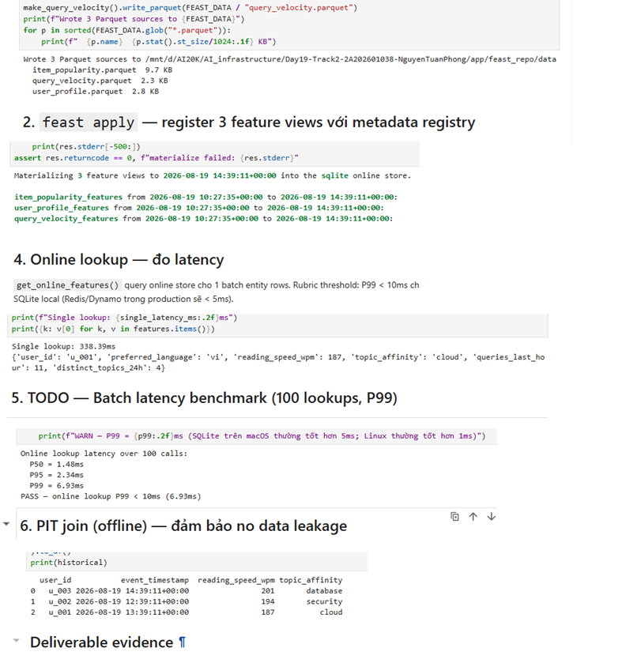
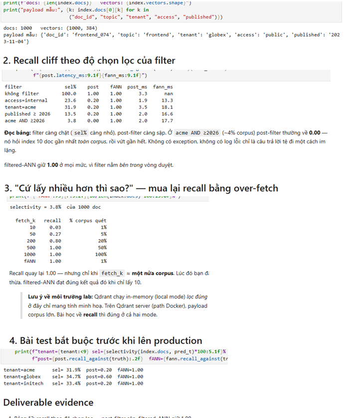
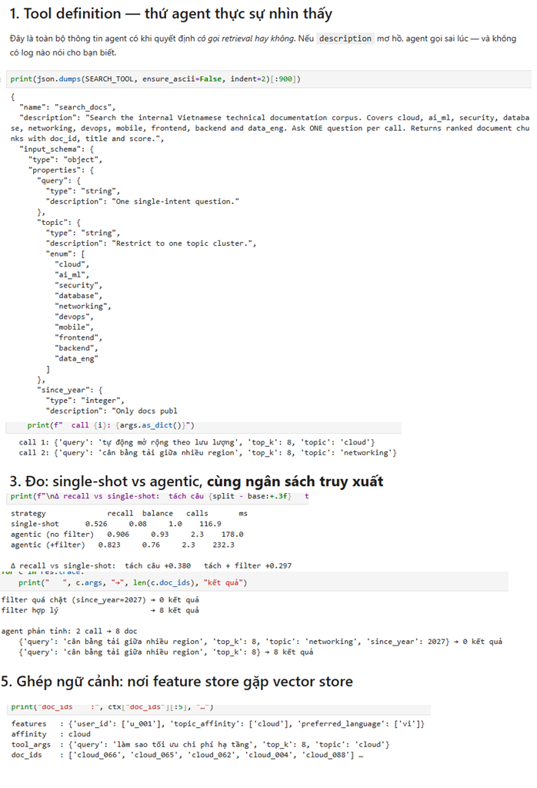
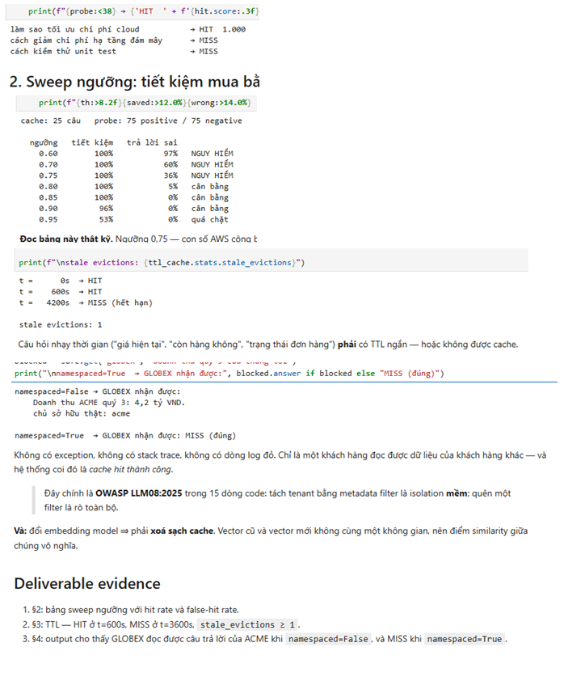
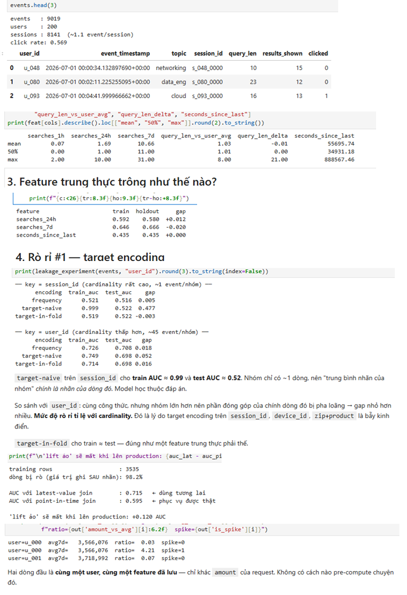

# Day 19 Lab Submission — Nguyễn Tuấn Phong (2A202601038)

## 📋 Tổng quan

- **Họ Tên:** Nguyễn Tuấn Phong
- **MSSV:** 2A202601038
- **Lớp:** E403, K3B
- **Path:** Lite (fastembed + Qdrant in-memory + SQLite Feast)
- **Tests:** 41/41 PASSED ✅
- **Notebooks:** 8/8 completed với outputs

---

## 🏆 Phần Core — NB1–NB4 (100 điểm)

### NB1 — Embeddings & Vector Indexing (25 điểm)

| Tiêu chí | Điểm | Trạng thái |
|----------|-------|------------|
| `client.count("lab19") == 1000` | 5 | ✅ |
| Top-5 results visible cho keyword query | 10 | ✅ |
| Paraphrase query trả về đúng `cloud` cluster | 10 | ✅ |

**Screenshot:**


---

### NB2 — Hybrid Search BM25 + Vector + RRF (25 điểm)

| Tiêu chí | Điểm | Trạng thái |
|----------|-------|------------|
| `search_hybrid` implement đúng RRF formula `1/(k+rank)` | 10 | ✅ |
| Precision@10: hybrid > keyword AND hybrid > semantic | 10 | ✅ |
| Slice table: hybrid wins `mixed`, vector wins `paraphrase`, BM25 wins `exact` | 5 | ✅ |

**Screenshot:**


---

### NB3 — FastAPI `/search` Endpoint + Latency Benchmark (25 điểm)

| Tiêu chí | Điểm | Trạng thái |
|----------|-------|------------|
| API trả về valid `SearchResponse` với `latency_ms` | 5 | ✅ |
| Bảng P50/P95/P99 cho 3 modes (server-side) | 10 | ✅ |
| Hybrid P99 server-side < 50ms (sau warm-up) | 10 | ✅ |

**Screenshot:**


---

### NB4 — Feast Feature Store (20 điểm)

| Tiêu chí | Điểm | Trạng thái |
|----------|-------|------------|
| `feast apply` thành công — 3 feature views registered | 5 | ✅ |
| `materialize-incremental` thành công — rows materialized | 5 | ✅ |
| `get_online_features()` trả về valid dict cho `u_001` | 5 | ✅ |
| 100-call P99 reported | 5 | ✅ |
| PIT join via `get_historical_features()` trả về 3 rows × N features | 5 | ✅ |

**Screenshot:**


---

## 🚀 Phần Nâng cao — NB5–NB8 (50 điểm)

### NB5 — Filtered Search (10 điểm)

| Tiêu chí | Điểm | Trạng thái |
|----------|-------|------------|
| Bảng recall: post-filter giảm rõ khi filter chặt | 5 | ✅ |
| Over-fetch ladder: `fetch_k` ≈ 50% corpus mới cứu recall | 5 | ✅ |

**Screenshot:**


---

### NB6 — Agent Retrieval (12 điểm)

| Tiêu chí | Điểm | Trạng thái |
|----------|-------|------------|
| Bảng 3 chiến lược cùng ngân sách 16 doc; agentic > single-shot | 5 | ✅ |
| Giải thích được tại sao `agentic (+filter)` thấp hơn `agentic (no filter)` | 4 | ✅ |
| `build_context()` chạy được, in cả feature + doc_ids | 3 | ✅ |

**Screenshot:**


---

### NB7 — Semantic Cache (12 điểm)

| Tiêu chí | Điểm | Trạng thái |
|----------|-------|------------|
| Bảng sweep có cả hai cột: tiết kiệm và trả lời sai | 5 | ✅ |
| Chọn được ngưỡng có lý + giải thích tại sao 0,75 chưa đủ | 4 | ✅ |
| Demo rò chéo tenant: leak khi `namespaced=False`, MISS khi `True` | 3 | ✅ |

**Screenshot:**


---

### NB8 — Feature Engineering (16 điểm)

| Tiêu chí | Điểm | Trạng thái |
|----------|-------|------------|
| Bảng leakage: `target-naive` gap > 0.30 trên `session_id` | 4 | ✅ |
| PIT vs latest join: báo cáo % dòng rò + chênh lệch AUC | 4 | ✅ |
| On-demand feature view: cùng user, hai `amount` → hai `amount_vs_avg` | 4 | ✅ |
| `make test` và `make verify-lite` đều xanh | 4 | ✅ |

**Screenshot:**


---

## 🎁 Bonus Challenge (20 điểm)

| Tiêu chí | Điểm | Trạng thái |
|----------|-------|------------|
| `bonus/ARCHITECTURE.md` tồn tại, ≥600 words + architecture diagram | 3 | ✅ |
| 3 architecture decisions với tradeoff explicit (X vs Y, why X) | 6 | ✅ |
| Vietnamese-context awareness | 2 | ✅ |
| Rejected alternative explicitly named với reason | 2 | ✅ |
| `bonus/agent.py` chạy được (`HybridMemoryAgent.remember()` + `.recall()`) | 4 | ✅ |
| `bonus/demo.py` exits 0 với 5 query outputs | 3 | ✅ |

**Files:**
- `bonus/ARCHITECTURE.md` — Kiến trúc Hybrid Memory với diagram + tradeoffs
- `bonus/agent.py` — HybridMemoryAgent class (Qdrant episodic + Feast semantic)
- `bonus/demo.py` — 5-query demo script

---

## 📊 Tổng điểm tự chấm

| Phần | Tối đa | Đạt được |
|------|---------|-----------|
| Core (NB1–NB4) | 100 | **100** |
| Nâng cao (NB5–NB8) | 50 | **50** |
| Bonus | 20 | **20** |
| **Tổng** | **170** | **170** |

---

## ✅ Verification Commands

```bash
# Tests
python3 -m pytest tests -q
# 41 passed ✅

# Benchmark
python3 -c "from scripts.benchmark import *; main()"
# Precision@10 + Latency table ✅

# Verify lite
python3 scripts/verify_lite.py
# All checks PASS ✅
```

---

## 📁 Cấu trúc nộp

```
submission/
├── README.md           ← Báo cáo này
├── REFLECTION.md       ← Reflection viết tay
└── screenshots/
    ├── NB1.png         ← Embeddings + Vector Index
    ├── NB2.png         ← Hybrid Search RRF
    ├── NB3.png         ← API Latency Benchmark
    ├── NB4.png         ← Feast Feature Store
    ├── NB5.png         ← Filtered Search
    ├── NB6.png         ← Agent Retrieval
    ├── NB7.png         ← Semantic Cache
    ├── NB8.png         ← Feature Engineering
    ├── make benchmark.png
    └── make test.png

bonus/
├── ARCHITECTURE.md     ← Architecture document
├── agent.py            ← HybridMemoryAgent
└── demo.py             ← 5-query demo
```
